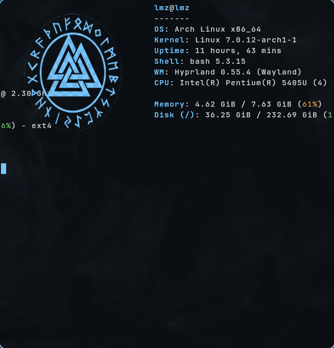

# NordicOS

> Sistema de escritorio Hyprland con identidad visual vikinga coherente, construido alrededor de un único generador de paleta que sincroniza todos los componentes del sistema desde una sola fuente de verdad.



[](LICENSE)

---

## Tabla de contenidos

1. [Visión general](#visión-general)
2. [Filosofía de diseño](#filosofía-de-diseño)
3. [Arquitectura](#arquitectura)
4. [Inicio rápido](#inicio-rápido)
5. [Gestión de wallpapers](#gestión-de-wallpapers)
6. [Estructura del proyecto](#estructura-del-proyecto)
7. [Stack tecnológico](#stack-tecnológico)
8. [Sistema de paleta](#sistema-de-paleta)
9. [Comandos disponibles](#comandos-disponibles)
10. [Flujo de trabajo diario](#flujo-de-trabajo-diario)
11. [Testing](#testing)
12. [Herramientas de mantenimiento](#herramientas-de-mantenimiento)
13. [Documentación](#documentación)
14. [Versionado y releases](#versionado-y-releases)
15. [Roadmap](#roadmap)
16. [Contribución](#contribución)
17. [Licencia y autoría](#licencia-y-autoría)

---

## Visión general

**NordicOS** es un *rice* (configuración estética completa) para Hyprland que lleva la metáfora del drakkar vikingo al escritorio: hierro sobre escarcha, madera sellada sobre cubierta, una paleta única y doce roles semánticos que cualquier componente del sistema puede heredar.

El núcleo del proyecto no es un *theme* en sentido tradicional — es un **sistema de tokens** con un único archivo editable (`palette/master.css`) desde el que se regeneran automáticamente todos los archivos de configuración de color de los componentes del sistema.

```
                    palette/master.css
                            |
                            v
                    palette/build.js
                            |
            +-------+-------+-------+-------+
            v               v               v
         Waybar          Kitty           Wofi
     (nordic.css)    (theme.conf)     (style.css)
            |               |               |
            v               v               v
       Hyprland         Dunst           AGS
     (marker block)   (dunstrc)    (theme-tokens-auto.ts)
```

**Siete destinos**, una sola fuente, cero valores duplicados.

---

## Filosofía de diseño

NordicOS parte de tres principios que están documentados en profundidad en [`docs/design-language.md`](docs/design-language.md):

- **Hierro sobre escarcha.** Materiales fríos, densos, con peso. Nada brilla por accidente.
- **El mar manda.** El wallpaper es paisaje, no decoración. La UI flota sobre él, no lo tapa.
- **Cada módulo merece su solemnidad.** No todo es ceremonial, pero nada es trivial.

La paleta canónica tiene solo **doce colores** (más tres extras en kitty para ANSI extendido) y cada uno evoca un material: hierro fundido, roble sellado, acero frío, hielo glaciar, hueso tallado, musgo sobre roca, sangre seca. Los nombres son **semánticos** (`accent`, `error`, `text`), nunca descriptivos — cambiar el azul por rojo es un solo hex, no un rename en cascada.

La documentación del lenguaje visual cubre jerarquía tipográfica, sistema de marcos, escala de solemnidad, motivos ceremoniales (Valknut, runas Elder Futhark), voz del sistema y patrones prohibidos. Está escrita como un contrato: cualquier pieza nueva que no respete el contrato debe poder justificarlo narrativamente.

---

## Arquitectura

### Single source of truth

Un único archivo (`palette/master.css`) declara doce `@define-color` con nombres semánticos. El resto del sistema se deriva de él:

| Token | Hex | Material evocado |
|---|---|---|
| `bg` | `#0b0f14` | Hierro fundido en frío |
| `surface` | `#151c24` | Roble sellado al aceite |
| `surface-alt` | `#1a2332` | Cuero curtido y bruñido |
| `border` | `#3b556d` | Acero forjado en frío |
| `accent` | `#78c7ff` | Hielo glaciar bajo luz oblicua |
| `accent-soft` | `#a0d4ff` | Nieve iluminada por amanecer |
| `text` | `#d4dde3` | Hueso blanco tallado |
| `text-muted` | `#8a9bab` | Tinta diluida en agua |
| `success` | `#6fbf73` | Musgo sobre roca |
| `warning` | `#d89b3c` | Latón viejo / oro deslucido |
| `error` | `#b84c4c` | Sangre seca sobre acero |
| `shadow` | `#1a1a1a` | Carbón profundo (Hyprland shadow, alpha `ee`) |

### Estrategias de generación

`palette/build.js` aplica tres estrategias distintas según la naturaleza del destino:

1. **Full replacement** — el archivo destino se regenera por completo. Usado para `waybar`, `wofi`, `dunst` y `ags`.
2. **Included via `include`** — `kitty` separa la paleta en un `theme.conf` que `kitty.conf` incluye. La primera ejecución migra el config automáticamente (*one-shot*).
3. **Marker-block splice** — `hyprland.lua` tiene cientos de líneas (keybinds, monitors, animations). El build delimita dos bloques con markers (`NORDICOS PALETTE START/END` y `NORDICOS SHADOW START/END`) y reemplaza solo el contenido entre ellos. Idempotente y *byte-stable*.

Fuera del build de paleta, `install.sh` usa una cuarta estrategia para un destino distinto (no depende de `master.css`):

4. **Renderizado de plantilla** — `hyprpaper.conf` se genera sustituyendo placeholders (`@WALLPAPER_DIR@`, `@BOOT_WALLPAPER@`) en `templates/hyprpaper.conf.in` vía `sed`, directamente desde `install.sh`. Ver [Gestión de wallpapers](#gestión-de-wallpapers).

### Renames explícitos

Cada componente tiene su propio vocabulario. El build traduce los nombres semánticos del master al dialecto de cada app:

| Master token | Waybar | Kitty | Wofi | Hyprland |
|---|---|---|---|---|
| `accent` | `ice` | `cursor` + `color6/12` | `accent` | `active_border[0]` |
| `accent-soft` | `ice-soft` | `url_color` + `color14` | `accent-soft` | `active_border[1]` |
| `error` | `danger` | `color1/9` | `error` | — |
| `text` | `text` | `foreground` + `color7` | `text` | — |
| `border` | `border` | `selection_background` + `color4/8` | `border` | `inactive_border` |

Los renames se declaran una sola vez por componente (objetos `*_MAPPING` al inicio de `palette/build.js`). El orden es estable: los diffs entre builds son predecibles.

### Validaciones

Cada `npm run build` ejecuta:

- Validación de hex estricto (`/^#[0-9a-fA-F]{6}$/`)
- Warnings estructurados por línea malformada en `master.css`
- **Validación de sintaxis Lua** del bloque Hyprland con `luac -p -` antes de escribir
- Tres substrings requeridos en el bloque Lua (forma estructural)
- **Idempotencia** por *byte-equality* — si el contenido destino no cambia, no se bumpea mtime y no se genera backup
- Escritura atómica (`writeFile` a `.tmp` + `rename`) — nunca queda un archivo corrupto a mitad de escritura

---

## Inicio rápido

### Requisitos

- **Sistema operativo:** Linux (probado en Arch, CachyOS, Nobara)
- **Compositor:** Hyprland
- **Runtime:** Node.js 18+ (testado en 20 LTS y 22)
- **Opcional:** `luac` (lua compiler) para validación sintáctica del bloque Hyprland durante el build

### Instalación

```bash
# 1. Clonar el repositorio (la ruta destino es un ejemplo, puede ser cualquiera)
git clone https://github.com/Lmz-23/NordicOS.git ~/nordicos
cd ~/nordicos

# 2. Ejecutar install.sh (crea symlinks + npm install + npm run build)
./install.sh
```

> **El repo puede clonarse en cualquier ruta.** `install.sh` deriva `SCRIPT_DIR` dinámicamente a partir de su propia ubicación (`$(cd "$(dirname "${BASH_SOURCE[0]}")" && pwd)`) en vez de asumir una ruta fija — esta es precisamente la propiedad que permitió reparar el sistema cuando el repo se movió de `/home/lmz/nordicos` a `/home/lmz/Proyectos/nordicos`: bastó con volver a ejecutar `./install.sh` desde la nueva ubicación para que todos los symlinks se regeneraran correctamente. Ver [`STATE.md`](STATE.md) para el detalle de ese incidente.

`install.sh` es un espejo completo de `$HOME` (`SRC_ROOT="$SCRIPT_DIR/home"` → `DST_ROOT="$HOME"`), no solo de `~/.config/` — esto le permite gestionar también archivos fuera de `.config/`, como los scripts en `~/.local/bin/`.

El script es idempotente y maneja las siguientes categorías de archivos:

- **Symlinks** (`waybar/config.jsonc`, `ags/*`, `kitty/kitty.conf`, `.local/bin/wallpaper-rotate.sh`, etc.) → apuntando a `home/` en el repo
- **Mirror copy** (`hypr/hyprland.lua`) → sincronizado via `bin/sync-tracking.sh pull`
- **Generados por build** (`themes/nordic.css`, `theme.conf`, `dunstrc`, etc.) → regenerados en cada `npm run build`
- **Generado desde plantilla** (`hyprpaper.conf`) → renderizado por el propio `install.sh` a partir de `templates/hyprpaper.conf.in` (ver [Gestión de wallpapers](#gestión-de-wallpapers))

Al final, `install.sh` reconcilia `systemd --user` de forma defensiva (`daemon-reload` + `enable` de `hyprpaper.service` y `wallpaper-rotate.timer`); si `systemctl` no está disponible, el script continúa sin fallar.

Para recargar componentes después de editar:
```bash
systemctl --user reload waybar    # usa SIGUSR2 internamente
hyprctl reload                    # bordes y sombras
killall kitty && kitty            # nueva terminal con colores nuevos
pkill dunst && dunst &            # notificaciones
```

### Destinos generados

| Componente | Path destino | Estrategia |
|---|---|---|
| Waybar | `~/.config/waybar/themes/nordic.css` | Full replacement |
| Kitty | `~/.config/kitty/theme.conf` | Included via `kitty.conf` |
| Wofi | `~/.config/wofi/style.css` | Full replacement |
| Hyprland (palette) | `~/.config/hypr/hyprland.lua` (entre markers PALETTE) | Marker-block splice |
| Hyprland (shadow) | `~/.config/hypr/hyprland.lua` (entre markers SHADOW) | Marker-block splice |
| Dunst | `~/.config/dunst/dunstrc` | Full replacement |
| AGS widgets | `~/.config/ags/lib/theme-tokens-auto.ts` | Full replacement (TypeScript module) |
| Hyprpaper | `~/.config/hypr/hyprpaper.conf` | Renderizado desde plantilla (`templates/hyprpaper.conf.in`) por `install.sh` |

*Además se genera `palette/preview.html` como artefacto local (ignorado en git).*

`hyprpaper.conf` es un caso aparte: no lo genera `palette/build.js` (no depende de `master.css`), sino `install.sh` directamente, sustituyendo dos placeholders (`@WALLPAPER_DIR@`, `@BOOT_WALLPAPER@`) en la plantilla. Ver [Gestión de wallpapers](#gestión-de-wallpapers).

### Activar el modo de regeneración automática

```bash
npm run watch
```

Edita `palette/master.css` en cualquier editor y los siete destinos se regeneran automáticamente al guardar. Debounce de 200 ms; cierre limpio con `Ctrl+C`.

---

## Gestión de wallpapers

El pack de wallpapers vive en `assets/wallpapers/` (10 fondos: `atadura.png`, `bote.png`, `cuervo.png`, `fiord.png`, `guerra.png`, `monolito.png`, `odin.png`, `ragnarok.png`, `thorvsjogg.png`, `tyr&fenrir.png`). Dos mecanismos independientes trabajan sobre este directorio:

### Wallpaper estático al arrancar sesión (`hyprpaper.conf`)

`install.sh` renderiza `templates/hyprpaper.conf.in` hacia `~/.config/hypr/hyprpaper.conf`, aplicando un wallpaper fijo (`guerra.png` por defecto, con fallback automático al primer `.png` alfabético si no existe) de forma inmediata al arrancar `hyprpaper.service` — sin depender de que un timer se dispare después. Este archivo declara `ipc = on`, requisito obligatorio para que el rotador (siguiente sección) pueda hablarle a `hyprpaper` vía `hyprctl hyprpaper wallpaper ...`; si se desactiva, la rotación falla en silencio.

`hyprpaper.conf` se marca como generado con un comentario (`# NordicOS — archivo GENERADO por install.sh. No editar a mano.`) en su primera línea. Si `install.sh` encuentra un `hyprpaper.conf` preexistente sin ese marcador (un archivo artesanal del usuario), lo respalda con timestamp antes de sobrescribirlo. Si el archivo generado no cambia, no se reescribe.

### Rotación periódica (`wallpaper-rotate.sh` + timer)

`home/.local/bin/wallpaper-rotate.sh` (versionado en el repo y symlinkeado por `install.sh`) rota circularmente por todos los `.png` de `assets/wallpapers/` y aplica el mismo wallpaper a todos los monitores conectados vía `hyprctl hyprpaper wallpaper <monitor>,<archivo>`. El índice de rotación persiste en `${XDG_STATE_HOME:-$HOME/.local/state}/wallpaper-rotate-state`.

El script resuelve la ruta del pack de wallpapers en tiempo de ejecución, sin rutas hardcodeadas:

1. Si la variable de entorno `NORDICOS_WALLPAPER_DIR` está definida y apunta a un directorio existente, se usa esa.
2. Si no, el script asciende desde su propia ubicación real (`readlink -f`) hasta 5 niveles buscando la raíz del repo (marcador: presencia simultánea de `install.sh` y `assets/wallpapers/`).
3. Si ninguna de las dos resuelve, falla con un error explícito en el log (`~/.local/state/wallpaper-rotate.log`), sin fallback silencioso a una ruta adivinada.

La rotación se dispara mediante `wallpaper-rotate.timer` (`OnBootSec=20min`, `OnUnitActiveSec=20min`) invocando `wallpaper-rotate.service`. El `OnBootSec` ya no necesita ser corto porque el `hyprpaper.conf` estático cubre el arranque en frío; el timer solo se encarga de la rotación periódica posterior.

---

## Estructura del proyecto

```
nordicos/
├── palette/
│   ├── master.css              ← ÚNICO archivo a editar para cambiar colores
│   ├── build.js                ← Generador: lee master.css, escribe 7 destinos
│   ├── watch.js                ← Watcher con debounce 200ms (chokidar)
│   ├── preview.html            ← Preview visual autogenerado (ignorado en git)
│   ├── README.md               ← Documentación del subsistema de paleta
│   └── test/
│       └── build.test.js       ← Suite de tests (node:test)
├── docs/
│   ├── design-language.md      ← ADN visual: manifiesto, principios, patrones
│   ├── design-system.md        ← Especificación técnica: tokens, contratos, validaciones
│   └── references/             ← Capturas canónicas y material de referencia
├── assets/
│   ├── wallpapers/             ← 10 fondos (drakkar, fiordos, runas, etc.)
│   └── ornaments/              ← Valknut y marcos ornamentales
├── templates/
│   └── hyprpaper.conf.in       ← Plantilla renderizada por install.sh (placeholders @WALLPAPER_DIR@, @BOOT_WALLPAPER@)
├── home/
│   └── .local/bin/
│       └── wallpaper-rotate.sh ← Rotador de wallpapers (versionado, symlinkeado por install.sh)
├── bin/
│   ├── sync-tracking.sh        ← pull/push de archivos híbridos (hyprland.lua)
│   └── quarantine-legacy.sh    ← Cuarentena (nunca borrado) de *.bak*/.disabled/.broken/.orig sueltos en ~/.config
├── backups/                    ← Snapshots automáticos por cambio (versionados)
├── install.sh                  ← Espejo de $HOME: symlinks + hyprpaper.conf + systemd + npm install/build
├── STATE.md                    ← Estado del proyecto, issues resueltos, pendientes
├── package.json
├── package-lock.json
└── README.md                   ← Este archivo
```

---

## Stack tecnológico

**Runtime del sistema:**

| Componente | Tecnología | Rol |
|---|---|---|
| Compositor | [Hyprland](https://hyprland.org/) | Window manager dinámico |
| Barra | [Waybar](https://github.com/Alexays/Waybar) | Barra superior con módulos |
| Terminal | [Kitty](https://sw.kovidgoyal.net/kitty/) | Emulador de terminal GPU |
| Launcher | [Wofi](https://hg.sr.ht/~scoopta/wofi) | Lanzador de aplicaciones |
| Notificaciones | [Dunst](https://dunst-project.org/) | Demonio de notificaciones |
| Widgets | [AGS](https://github.com/Aylur/ags) (Astal/GJS) | Widgets GTK custom (calendar, battery) |

**Tooling del proyecto:**

| Pieza | Tecnología | Uso |
|---|---|---|
| Generador | Node.js (>=18) | Sin dependencias externas excepto `chokidar` |
| Watcher | [chokidar](https://github.com/paulmillr/chokidar) 3.6 | Detección de cambios en `master.css` |
| Tests | `node:test` (built-in) | Suite sin dependencias |
| Validación Lua | `luac -p -` | Verifica sintaxis del bloque Hyprland antes de escribir |

**Tipografía:** JetBrainsMono Nerd Font (primaria), Symbols Nerd Font, FontAwesome, Roboto, Helvetica, Arial, sans-serif. Stack consolidado en la constante `FONT_STACK` dentro de `palette/build.js`.

---

## Sistema de paleta

### Cómo cambiar un color

1. Editar `palette/master.css` (único archivo que el usuario toca).
2. Guardar.
3. Si el watcher está corriendo (`npm run watch`), los siete destinos se regeneran automáticamente. Si no, ejecutar `npm run build`.
4. Recargar componentes manualmente para ver los cambios en vivo:

```bash
pkill waybar && waybar &          # Waybar
hyprctl reload                    # Hyprland (bordes y sombras)
killall kitty && kitty            # Kitty
wofi --show drun                  # Wofi (efímero, se ve al invocarlo)
pkill dunst && dunst &            # Dunst
```

### Nombres semánticos, no descriptivos

Los tokens son **roles**, no colores. Cambiar `accent` de azul a rojo es un solo hex; el nombre sigue siendo `accent`. Los renames por componente (`accent → ice` en Waybar, `error → danger` en Waybar) están declarados una sola vez en los objetos `*_MAPPING` de `palette/build.js`.

Para detalles exhaustivos sobre mappings por componente, variantes alpha de `accent` en Wofi, hardcoded extras de Kitty y restricciones de formato del bloque Hyprland Lua, ver [`palette/README.md`](palette/README.md).

---

## Comandos disponibles

Definidos en [`package.json`](package.json):

```bash
npm run build      # Genera la paleta una vez (lee master.css, escribe 7 destinos)
npm run watch      # Modo vigilante: rebuild automático al guardar master.css
npm run preview    # Abre palette/preview.html en el navegador (xdg-open)
npm test           # Ejecuta la suite de tests (palette/test/build.test.js)
```

---

## Flujo de trabajo diario

### Cambiar un color

```bash
# Terminal 1 — watcher activo
cd ~/nordicos && npm run watch

# Terminal 2 (o tu editor) — editar master.css
nano palette/master.css
# guardar → el watcher detecta cambio → build automático → output inline

# Recargar componentes manualmente
pkill waybar && waybar &
hyprctl reload
killall kitty && kitty
```

### Añadir un token nuevo

1. Añadir línea `@define-color mi-token #abcdef;` en `palette/master.css` (respetar la sección narrativa correspondiente).
2. Si el token debe llegar a algún componente, declarar el mapping en su objeto `*_MAPPING` correspondiente dentro de `palette/build.js`.
3. Si el token tiene un destino completamente nuevo (Hyprlock, GTK, Conky), redactar el contrato siguiendo el formato de `docs/design-system.md` §4.
4. Añadir tests para el nuevo mapping/función en `palette/test/build.test.js`.

---

## Testing

```bash
npm test
```

Suite implementada con `node:test` (built-in, sin dependencias). Cubre:

- **`HEX_REGEX`** — validación estricta de hex de 6 dígitos con `#`
- **`parseMaster`** — parser de `@define-color` con warnings estructurados por línea
- **`hexToRgba` / `hexToRgbaString` / `hexToHyprlandNumber`** — helpers de conversión
- **`escapeHtml`** — escape de 5 entidades para el preview HTML
- **`buildWaybarTheme`** — GTK CSS con renames `accent → ice`, `error → danger`
- **`buildKittyTheme`** — directivas kitty + 16 ANSI + 3 extras hardcoded
- **`buildWofiStyle`** — CSS plano + 4 variantes alpha de `accent` (0.06, 0.10, 0.15, 0.30)
- **`buildHyprlandColors`** — bloque Lua con gradient *table form*, 3 substrings requeridos, no trailing newline, idempotencia byte-a-byte
- **`buildHyprlandShadow`** — bloque Lua con `0xAARRGGBB` numérico, markers SHADOW independientes de los PALETTE
- **`buildDunstConfig`** — `[global]` + 3 secciones `[urgency_*]` con 3 directivas cada una
- **`buildPreviewHtml`** — documento HTML self-contained con todas las cards
- **`replaceMarkerBlock`** — splice puro (no toca disco), retorna null si faltan markers
- **`atomicWrite`** — POSIX-atomic via `.tmp` + `rename`, mkdir -p recursivo, sin residuos
- **`generateDiff`** — diff LCS unificado, retorna null si contenido idéntico
- **`WAYBAR_MAPPING` / `KITTY_MAPPING` / `WOFI_MAPPING` / `KITTY_EXTRAS`** — integridad estructural

Las pruebas de luac se saltan automáticamente si el binario no está instalado (`{ skip: !commandExists('luac') }`).

---

## Herramientas de mantenimiento

### `bin/quarantine-legacy.sh`

Compañero de `bin/sync-tracking.sh`. Archiva de forma segura y reversible los archivos `.bak*`/`.disabled`/`.broken`/`.orig` sueltos que se acumulan en `~/.config` tras migraciones o backups históricos (por ejemplo, los que genera `install.sh` cada vez que reemplaza un archivo regular por un symlink).

Funciona en dos fases y **nunca borra ni sigue symlinks** (un symlink roto no se considera basura huérfana):

```bash
./bin/quarantine-legacy.sh            # Fase 1: inventario, solo lectura
./bin/quarantine-legacy.sh --apply    # Fase 2: mueve los archivos encontrados
```

Los archivos se mueven (nunca se copian ni se eliminan) a `backups/quarantine-<timestamp>/`, preservando su ruta relativa dentro de `~/.config`, junto a un `MANIFEST.txt` con instrucciones de restauración. Es idempotente: tras un `--apply`, una nueva corrida en modo inventario debe reportar 0 archivos.

---

## Documentación

El proyecto tiene tres documentos que se complementan sin duplicarse:

| Documento | Qué contiene | Cuándo leerlo |
|---|---|---|
| [`docs/design-language.md`](docs/design-language.md) | Manifiesto, principios, metáfora fundacional, jerarquía tipográfica, motivos ceremoniales, anti-patrones | Antes de añadir cualquier componente nuevo al sistema |
| [`docs/design-system.md`](docs/design-system.md) | Especificación técnica: capas de tokens, contratos por app, validaciones del build | Al implementar o extender el build.js |
| [`palette/README.md`](palette/README.md) | Detalles operativos del subsistema de paleta: mappings por componente, alpha variants, marker setup manual, troubleshooting | Al usar o extender el build |

**Regla de prioridad:** si estos documentos entran en conflicto, `design-language.md` gana sobre `design-system.md`, que gana sobre `palette/README.md`. Actualizar primero la fuente, sincronizar después.

**Regla del spec:** el spec manda sobre la implementación. Si una app diverge del contrato, la app está mal. Si el contrato es incorrecto, se actualiza el contrato, después el ADN, después la paleta, después el build, después las apps. **Nunca** se ajusta el contrato para coincidir con una implementación divergente.

---

## Versionado y releases

- **Semver ligero:** el proyecto usa [Semantic Versioning](https://semver.org/) en formato `MAJOR.MINOR.PATCH`.
- **Tag actual:** `v0.1.0` — primera iteración estable del sistema de paleta centralizada.
- **Conventional Commits:** los mensajes siguen el formato `tipo(scope): descripción` en español. Tipos usados: `feat`, `fix`, `refactor`, `docs`, `test`, `chore`.
- **Branches:**
  - `master` — producción/estable
  - `develop` — trabajo activo
- **Remote:** `https://github.com/Lmz-23/NordicOS.git`

### Historial reciente

```
278876a feat: Bloque B Fase 6 - integración final, single source of truth completo (master.css -> 7 destinos)
b4c2afe feat: Bloque B Fase 1 - widget Batería flotante con ags
036e053 Refactor code structure for improved readability and maintainability
488c7fd Implement code changes to enhance functionality and improve performance
5f78081 fix(build): remover newline extra en buildHyprlandColors
6414b21 feat: NordicOS palette centralizada inicial
```

---

## Roadmap

Componentes contemplados pero no integrados todavía:

| Componente | Estado | Bloqueo |
|---|---|---|
| Hyprlock (lock screen ceremonial) | Pendiente | Binario no instalado |
| Conky (paneles laterales con docker/git status) | No iniciado | — |
| Tema GTK global | No iniciado | — |
| Tema de iconos vikingo | No iniciado | — |
| SDDM (login manager) | Pendiente | Theme por defecto de la distro |
| Notificaciones críticas (Valknut animado) | Diseño | — |

Issues resueltos en el sistema de paleta actual (ver [`STATE.md`](STATE.md) para detalle):

1. `colors.css` huérfano — eliminado
2. Colores Hyprland fuera de paleta — bloque generado
3. `swww-daemon` muerto en autostart — eliminado
4. `style-legacy.css` (329 líneas) — eliminado
5. `config.jsonc.bak` — eliminado
6. JSON malformado en `config.jsonc` — corregido
7. Bug `buildHyprlandColors` (newline extra) — corregido
8. Block Hyprland shadow con sintaxis string-form — migrado a numeric form
9. Marker cross-contamination (PALETTE vs SHADOW) — pinneado con tests
10. Symlinks rotos tras mudanza del repo (`/home/lmz/nordicos` → `/home/lmz/Proyectos/nordicos`) + wallpaper con ruta hardcodeada y aplicación tardía (~30s) al iniciar sesión — corregido: `install.sh` deriva `SCRIPT_DIR` dinámicamente (bastó re-ejecutarlo), `wallpaper-rotate.sh` se versionó en el repo con auto-localización de `assets/wallpapers/`, y se añadió `hyprpaper.conf` estático para eliminar la espera del timer

---

## Contribución

NordicOS es un proyecto personal documentado como si fuera profesional. Las contribuciones externas son bienvenidas si respetan el lenguaje visual y los contratos técnicos.

**Antes de proponer un cambio:**

1. Lee [`docs/design-language.md`](docs/design-language.md) completo. Si tu propuesta introduce un gradiente chillón, glassmorphism genérico, neón saturado o emoji decorativo, no encaja.
2. Lee [`docs/design-system.md`](docs/design-system.md) §4 (contratos por app) si vas a tocar el build o añadir un destino nuevo.
3. Lee [`palette/README.md`](palette/README.md) si vas a modificar mappings existentes.

**Estilo de código:**

- Sin dependencias innecesarias. El build usa solo built-ins de Node.js (`fs`, `path`, `child_process`, `os`, `crypto`).
- Funciones puras siempre que sea posible. I/O aislado en `main()` y `writeComponentWithBackup()`.
- Comentarios en español, formato de cabecera con `===` separators.
- Tests con `node:test` + `node:assert/strict`. Sin frameworks externos.
- Mensajes de commit en español, Conventional Commits.

**Verificación previa a un PR:**

```bash
npm run build    # debe terminar sin errores
npm test         # todos los tests deben pasar
```

---

## Licencia y autoría

**Autor:** Lmz-23 ([@Lmz-23](https://github.com/Lmz-23))

NordicOS es un proyecto personal de configuración estética. El código del build (`palette/build.js`, `palette/watch.js`, tests) se distribuye bajo los términos de la [Licencia MIT](LICENSE); el contenido visual (wallpapers, marcos ornamentales, runas) es obra original del autor.

El Valknut, las runas Elder Futhark y los motivos nórdicos son símbolos culturales de uso libre; su inclusión en este proyecto es decorativa y referencial, sin afiliación a tradición religiosa o política alguna.

Este proyecto está licenciado bajo [MIT](LICENSE). Puedes usar, modificar y distribuir el código libremente bajo los términos de esa licencia.

---

> *"La cubierta no compite con el mar. Lo usa."*
> — Manifiesto de NordicOS